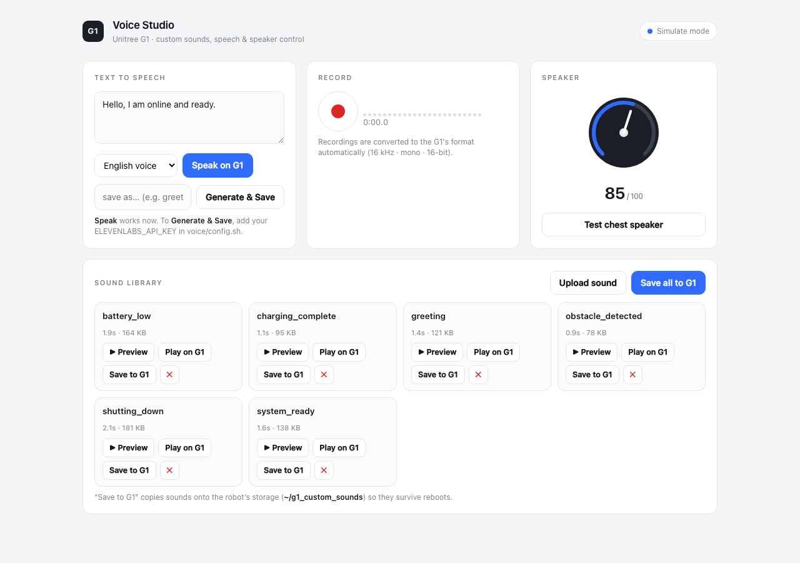
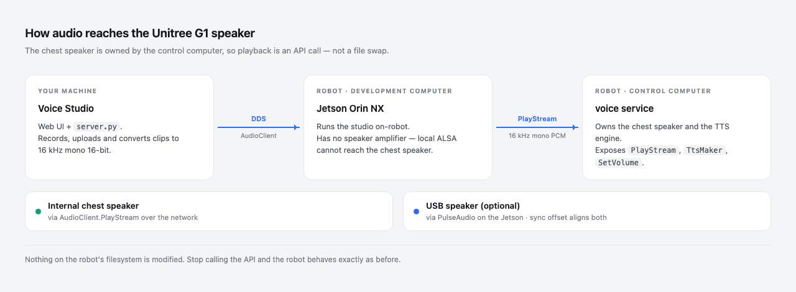

# G1 Custom Sounds

Play custom audio and English voice prompts on a Unitree G1, and manage the clips
from a small web UI.

The G1's built-in prompts are synthesized at runtime by an on-board service, not
stored as files, so this project drives the speaker through the `unitree_sdk2`
`AudioClient` API instead of replacing anything on disk. See
[docs/audio-architecture.md](docs/audio-architecture.md) for the details.



## Voice Studio

A local web app for working with the robot's audio:

- **Library** — upload any audio file; it is converted to the robot's format
  (16 kHz mono 16-bit) and can be played on the robot or previewed in the browser.
- **Record** — capture a clip from your microphone with a level meter.
- **Text to speech** — speak a line on the robot, or render it with ElevenLabs
  and keep it in the library.
- **Speaker** — volume control with a software boost range, and a test tone.
- **Save to robot** — copy clips to the robot's storage so they persist across
  reboots.

If a USB audio device is attached, playback goes to both it and the internal
speaker, with an adjustable sync offset.



```bash
cp voice/config.example.sh voice/config.sh   # set ELEVENLABS_API_KEY if using TTS
./scripts/voice_studio.sh --simulate         # run without a robot
./scripts/voice_studio.sh <ROBOT_IP> --iface eth0
```

Deployment on the robot itself is described in [voice/deploy](voice/deploy).

## Batch prompts

`voice/prompts.tsv` maps robot events to English lines. Render them to WAVs and
apply them to a robot:

```bash
./scripts/generate_voices.sh                    # prompts.tsv -> voice/generated/
./scripts/deploy_g1_voice.sh <ROBOT_IP> --iface eth0 --only P01
./scripts/deploy_g1_voice.sh <ROBOT_IP> --iface eth0
```

Prompts are risk-tiered; `L3` (safety-related) entries are skipped unless
`--include-safety` is passed.

## Requirements

- Python 3.8+ and `ffmpeg` on the machine running the tools
- [`unitree_sdk2_python`](https://github.com/unitreerobotics/unitree_sdk2_python)
  with `AudioClient.PlayStream`
- Network access to the robot's DDS interface
- An ElevenLabs API key, only for text-to-speech

## Layout

```
docs/         audio architecture and discovery/replacement procedures
scripts/      command line tools
voice/        Voice Studio app, prompt catalog, deployment files
  app/        web server and UI
  lib/        AudioClient wrapper
  deploy/     robot-side launcher and service unit
```

## Discovery and file replacement

The `docs/` and remaining `scripts/` files cover the older file-based workflow:
scanning a robot for audio assets, backing them up with checksums, converting
replacements to a matching format, and restoring. This is still useful for genuine
on-disk audio, but the G1's own voice prompts are not stored that way.

## Scope

This project only plays audio and manages audio files. It does not modify
firmware, motion, or safety systems.
