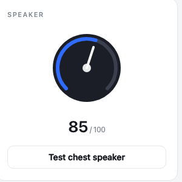

<!-- Title options. Delete this block and the front matter above before publishing if your CMS does not use them.
     1. The Unitree G1's voice isn't a file   <- used in index.html
     2. Two computers, one speaker: getting custom audio onto a Unitree G1
     3. What dpkg -S told me about the G1's voice prompts -->

# The Unitree G1's voice isn't a file

I wanted my Unitree G1 to say my own lines instead of its stock prompts. The obvious plan is to find the prompt audio on the robot's disk and replace it, and I built most of a toolchain around that plan: a scanner, a backup script that records checksums, a converter that matches the original file's exact format, a restore path for putting it all back.

Then it turned out there is no such audio on the disk. This is the sequence I went through, including the parts that wasted time.


*Voice Studio, the local web UI: text to speech, recording, speaker control, and the sound library.*

## What I expected to find

A robot that says "Battery low" out loud is getting that audio from somewhere, so I went looking for it. A scan of the robot's development computer turned up about fifty-five audio files.

All of it was stock desktop audio: the `alsa-utils` channel test clips, the Debian `sound-icons` set, GNOME alert sounds, `speech-dispatcher` fixtures.

One hit was `COPYING.opus`, a licence text file that matched because the first pass filtered on extension. The scanner in the repository now validates with `file --mime-type` and keeps only `audio/*` and `application/ogg`.

## One command settles it

The check that ends the search is package ownership:

```console
$ dpkg -S /usr/share/sounds/alsa/Front_Center.wav
alsa-utils: /usr/share/sounds/alsa/Front_Center.wav
```

If a distribution package owns a file, that file arrived with the operating system. Across every candidate nothing survived: no unowned audio file on the disk could plausibly be the robot's voice, which invalidated the file replacement premise entirely. The scanner labels each file `STOCK_PKG` or `UNOWNED` so the set can be read at a glance.

The backup and restore scripts I had written by that point were solving a problem that does not exist.

## The voice is synthesized at runtime

The G1's spoken prompts are produced on demand by an on-board service. There is no directory of prompt WAVs, which is why the search came up empty. Custom audio has to go in through the SDK instead, specifically the `unitree_sdk2` `AudioClient`.

One consequence is that there is no rollback procedure to write. Nothing on the robot's filesystem is modified, so stopping the API calls returns the robot to how it was.

## Two computers, one speaker

The G1 has two on-board computers. The Jetson Orin NX is the development computer, the one you log into and run your own code on. The second is the control computer, and it owns the chest speaker and the TTS engine.

The Jetson has no speaker amplifier. I worked through `aplay`, then `paplay`, then the Tegra APE mixer controls, looking for a route that would come out of the chest. No ALSA configuration on the Jetson will drive that speaker, because the amplifier is not attached to that computer.

The symptom that kept me there was the API call returning success while the robot stayed silent. The RPC was accepted and answered, just not by the machine I was sitting at and listening to. I was reading a return code as though the two computers were one.

I did not work this out from nothing. [`experientialtech/g1-audio-driver`](https://github.com/experientialtech/g1-audio-driver), which exposes the G1's microphone array and speaker as ordinary PulseAudio devices so that any Linux application can use them, already had this architecture mapped, and it is where this project started.


*The path audio takes. The chest speaker belongs to the control computer, so playback is an API call rather than a file swap.*

<figure>
  <!-- PHOTO PLACEHOLDER 1 of 2. Replace this comment with:
        -->
  <figcaption>PHOTO PLACEHOLDER: photograph of the Unitree G1. Caption to be written once the photo is added.</figcaption>
</figure>

## The last blocker was an SDK version gap

With the architecture understood, the call to make is `PlayStream`. The SDK present on the robot did not have it. `AudioClient` exposed `TtsMaker`, `GetVolume` and `SetVolume`, and nothing else. The check is one line:

```python
>>> hasattr(client, "PlayStream")
False
```

The gap went deeper than a missing wrapper. The RPC client underneath lacked the binary request method that `PlayStream` needs in order to carry PCM, so writing the wrapper myself would not have helped.

Vendoring a current `unitree_sdk2_python` fixed it. `PlayStream` wants 16 kHz, mono, 16-bit PCM, sent in chunks under one stream id:

```python
REQ_RATE, REQ_CHANNELS, REQ_SAMPWIDTH = 16000, 1, 2
CHUNK_BYTES = 32 * 1024

stream_id = str(int(time.time() * 1000))          # unique per utterance
for i in range(0, len(pcm), CHUNK_BYTES):
    client.PlayStream(app_name, stream_id, pcm[i:i + CHUNK_BYTES])
client.PlayStop(app_name)
```

`prompts.tsv` starts with P01, "Hello. I'm online and ready." That is the line sitting in the text box in the screenshot at the top of this post, and it is the one I keep coming back to when I want to know whether the whole path is still working.

There is also `TtsMaker(text, speaker_id)`, where `speaker_id` 0 is Chinese and 1 is English. On some firmware it returns success without producing audible output. What separates the firmware where that happens from the firmware where it does not is something I have not pinned down. Rendering the line to a WAV and sending it through `PlayStream` removes the dependency, so that is what the batch tooling does.

## Loudness, and why matching LUFS was not enough

The first pass normalized every clip with `loudnorm=I=-16:TP=-1.5:LRA=11`. Downloaded sound effects came out fine. Speech at the same integrated loudness sounded clearly quieter.

Integrated LUFS is an average across the clip. A mastered sound effect is compressed close to brick wall, so its average sits near its peak and it is loud essentially all the time. Speech has a wide dynamic range, so much of the clip sits well below its own peaks, and those peaks still have to fit under the true peak ceiling. Same number, different perceived loudness.

The fix is to compress the dynamic range first, then level the clip toward full scale, then limit so the result cannot clip:

```
acompressor=threshold=0.06:ratio=4:attack=5:release=130:makeup=3,
dynaudnorm=f=200:g=15:p=0.9:m=12,
alimiter=level_in=1:level_out=1:limit=0.97
```

Every clip entering the library goes through that chain, so speech and effects land at a comparable perceived loudness.

Speaker volume is separate. `SetVolume` takes 0 to 100 and is the hardware control. Above 100 the studio applies a software boost by multiplying the 16-bit samples before streaming. `audioop.mul` saturates at the sample limits, so pushing past the hardware maximum clips hard instead of turning to noise. `audioop` was removed in Python 3.13, so the import is guarded and the boost is unavailable there.



*Volume is the hardware control up to 100. The range above it is a software gain applied to the PCM before streaming.*

## A second output

A USB audio device plugged into the Jetson shows up as an ordinary PulseAudio sink, and unlike the chest speaker it is local, so `paplay` drives it directly. Playing to both at once needs an offset, because the internal path crosses the network to the control computer while the USB path does not.

The studio exposes that offset in milliseconds and includes a click train for tuning it by ear: a short 2 kHz blip every 500 ms. When the two outputs are aligned you hear single tight clicks, and when they are not you hear a flam. That is a cruder method than measuring it, and it converges faster.

`g1-audio-driver` solves the same problem a different way, loading PulseAudio's `module-combine-sink` to aggregate the outputs into one device. That is tidier than what I do, and it is the better choice if you want the robot to behave like a normal sound card. I play to the two outputs separately because a combined sink gives me nowhere to put the offset.

<figure>
  <!-- PHOTO PLACEHOLDER 2 of 2. Replace this comment with:
        -->
  <figcaption>PHOTO PLACEHOLDER: photograph of the USB speaker connected to the G1. Caption to be written once the photo is added.</figcaption>
</figure>

## What is in the repository

```
g1-custom-sounds/
├── README.md
├── docs/                  audio architecture, discovery and replacement procedures
├── scripts/               scanning, backup, conversion, generation, deployment
└── voice/
    ├── prompts.tsv        event to English line catalog
    ├── app/               Voice Studio server and web UI
    ├── lib/g1_play.py     AudioClient wrapper
    └── deploy/            robot-side launcher and systemd unit
```

Voice Studio runs on localhost or on the robot itself and handles uploading, recording, conversion, text to speech and playback. `prompts.tsv` maps robot events to English lines for batch generation, with entries risk tiered so that safety related lines are skipped unless explicitly included. There is a simulate mode that exercises every code path with no SDK and no robot, which is how most of the UI got built.

The `docs/` and the scanning scripts are the remains of the file replacement approach. I kept them, because they are still the right tools for genuine on-disk audio, and because the scan is how you prove to yourself that the G1's voice is not there.

## Scope

This project plays audio and manages audio files. It does not touch firmware, motion, or safety systems, and it does not modify anything on the robot's filesystem.

## Credits

**Author: Kamil Szwed** ([`szwedk`](https://github.com/szwedk)). The Voice Studio application, the scanning, backup and deployment scripts, the loudness pipeline and the dual output sync offset are mine.

**experientialtech** for [`g1-audio-driver`](https://github.com/experientialtech/g1-audio-driver), which inspired this project and which parts of it draw on. It bridges the G1's four-microphone array and its speaker into standard PulseAudio devices, and it reaches the speaker over the same `AudioClient.PlayStream` path this project uses. If you want the robot's audio hardware to appear as an ordinary Linux sound card rather than a managed clip library, start there.

**Unitree Robotics** make the robot and the SDK both projects depend on: [`unitree_sdk2_python`](https://github.com/unitreerobotics/unitree_sdk2_python), BSD 3-Clause, Copyright (c) 2016-2024 HangZhou YuShu Technology Co., Ltd. The `AudioClient` API, including `PlayStream`, `TtsMaker` and `SetVolume`, is theirs. This project is a client of that API, built on Unitree's official SDK rather than forked from it.

**ElevenLabs** provides the optional text to speech used to render the English prompts.

Project repository: [github.com/szwedk/g1-custom-sounds](https://github.com/szwedk/g1-custom-sounds)
